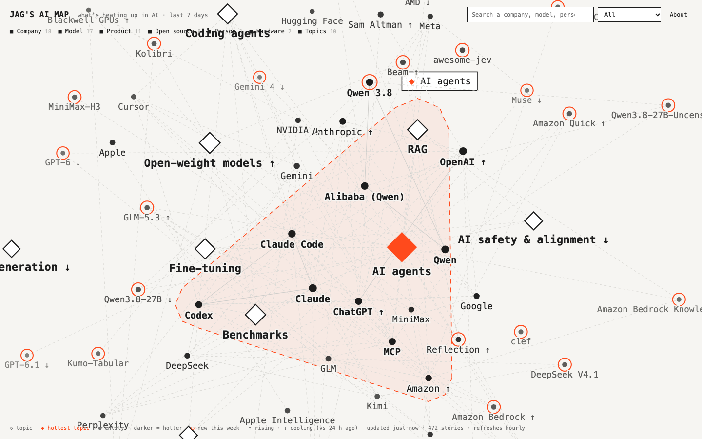

# Jag's AI Map

An interactive map of what's heating up in AI over the last 7 days: companies, models, products,
open-source projects, people, hardware and topics, sized and shaded by how much attention they get.
Inspired by [AI MAP by carlwow](https://aimap.goodcase.ai), built independently with English sources.



## Run it
```bash
./run.sh            # fetch news, extract entities, score heat -> web/data/data.json (1-5 min)
./serve.sh          # open http://localhost:8765
./run.sh --use-cache   # rebuild from the last fetch (no network), e.g. after tweaking scoring
```
Needs only Python 3 (standard library). `web/` is a static site: D3 is vendored in `web/vendor/`.

## How it works
- **Sources** (`pipeline/sources.py`): Hacker News (>30 points), TechCrunch, The Verge, VentureBeat,
  MIT Technology Review, Ars Technica, Wired, The Decoder, Simon Willison, OpenAI, Google AI, Google
  DeepMind, NVIDIA, Hugging Face and AWS ML blogs, Hugging Face daily papers and trending models, new
  AI repos on GitHub. Off-topic Hacker News stories are dropped.
- **Entities** (`pipeline/entities.py`): a curated dictionary of ~200 AI entities, automatic discovery of
  versioned model names (GPT-6.1, Claude Opus 5.5, Qwen3.8...), trending Hugging Face models and new
  GitHub repos, plus optional LLM extraction.
- **LLM extraction** (optional): any OpenAI-compatible endpoint, e.g. a local Qwen3.8-Flash. `run.sh` reads it from
  `.env` or, if present, the `strata` provider in a [pi](https://pi.dev) config (`~/.pi/agent/models.json`). Override with `AIMAP_LLM_BASE_URL`, `AIMAP_LLM_MODEL`,
  `AIMAP_LLM_API_KEY`, or disable with `AIMAP_LLM=off`.
- **Two views**: **Week** (`web/data/data.json`: 7 days, 24 h half-life, trend vs 24 h ago) and
  **Today** (`web/data/today.json`: 24 h, 6 h half-life, trend vs 6 h ago), switched in the page header.
- **Breaking**: an entity with at least 2 stories and 2.5x more (weighted) attention in the last 6 h than
  in the 6 h before gets an orange name and a pulsing ring, and can be filtered on. Hacker News stories
  under 3 h old count from 10 points (instead of 30) so breakouts are caught early.
- **Heat** (`pipeline/build.py`): each story adds `source weight x popularity boost x 0.5^(age/24h)`
  to every entity it mentions. "New" = not in the dictionary and first seen this week; up arrow =
  heat at least 1.5x its value 24 h earlier. Links = entities mentioned in the same stories.
  `data/history.json` keeps first-seen dates and a heat series for the sparklines.

## Files
| Path | What |
|---|---|
| `pipeline/` | Fetch, entity recognition, scoring (Python, stdlib only) |
| `web/` | The site: `index.html`, `app.js` (D3 graph), `style.css`, `data/data.json` |
| `data/` | `history.json` (kept), `stories-cache.json` (last fetch, git-ignored) |
| `.github/workflows/update.yml` | 12-hourly refresh + GitHub Pages deploy (for public hosting) |
| `deploy/local.ai-map.refresh.plist` | Optional 12-hourly refresh on this Mac (launchd) |
| `logs/` | Build logs |

## Licence and credits
MIT licence (see `LICENSE`). D3 is ISC-licensed (`web/vendor/D3-LICENSE.txt`). Headlines link to their publishers.

## Deployment (live)
**https://ai-news.jagular.io**, hosted on a home Linux server (Ubuntu) that also runs the Qwen model.

| Piece | Where | Notes |
|---|---|---|
| Code + data | `/opt/ai-map` | Same tree as here. `.env` (root-only) points the LLM step at `http://127.0.0.1:8080/v1` (strata, Qwen3.8-Flash) |
| Hourly refresh | `ai-map-refresh.timer` → `ai-map-refresh.service` runs `/opt/ai-map/run.sh` | `systemctl list-timers ai-map-refresh.timer`; logs: `journalctl -u ai-map-refresh` and `/opt/ai-map/logs/` |
| Web server | nginx site `/etc/nginx/sites-available/ai-news` | Static files from `/opt/ai-map/web`, alongside the existing emailbrain/trials sites |
| Public access | Cloudflare Tunnel `jag-ai-map` (`/etc/cloudflared/config.yml`, service `cloudflared`) | Only `ai-news.jagular.io` is routed; anything else returns 404. DNS CNAME created by `cloudflared tunnel route dns` |

Copies of these config files (no secrets) are in `deploy/server/`.
Qwen answers are cached per story in `data/llm-cache.json`, so hourly runs only send new headlines.

**Update the server after changing code here** (keeps the server's `.env`, data and caches):
```bash
rsync -a --exclude logs/ --exclude screenshots/ --exclude data/ --exclude .env --exclude web/data/ ./ root@<your-server>:/opt/ai-map/
```

## Configuration
Create `.env` next to `run.sh` (never committed):
```bash
AIMAP_LLM_BASE_URL=http://127.0.0.1:8080/v1   # any OpenAI-compatible server (vLLM, llama.cpp, Ollama...)
AIMAP_LLM_MODEL=your-model-id
AIMAP_LLM_API_KEY=your-key
```
Without it, the map still builds using the dictionary and model-name discovery.
